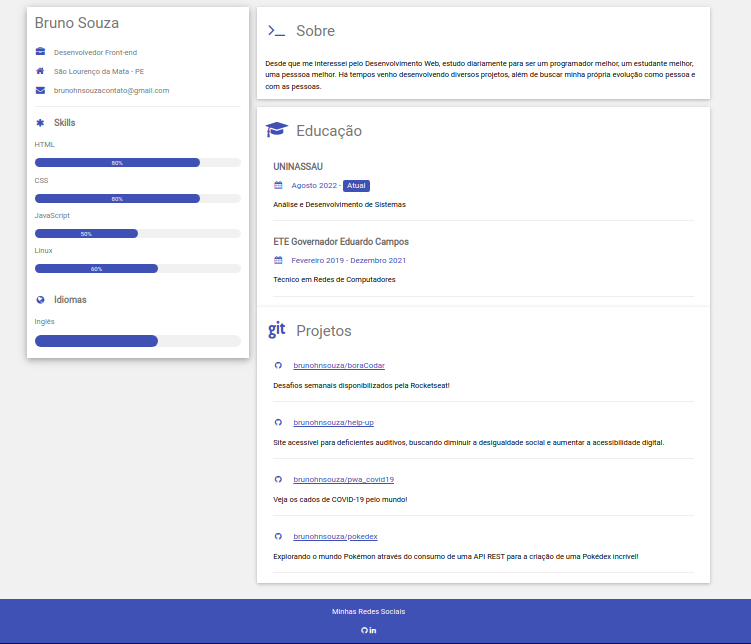

<h1 align="center">
    Currículo Online
</h1>

  <a href="#objetivo">Objetivo</a>&nbsp;&nbsp;&nbsp;|&nbsp;&nbsp;&nbsp;
  <a href="#tecnologias">Ferramentas</a>&nbsp;&nbsp;&nbsp;|&nbsp;&nbsp;&nbsp;
  <a href="#projeto">Projeto</a>

  

  

<h2 id="objetivo">🚀 <b>Objetivo:</b></h2>

- Explorar os pilares tecnológicos da carreira de Front-end, estruturando seu Currículo Online com HTML e CSS!

<h2 id="tecnologias">🔧 <b>Ferramentas:</b></h2>

- HTML e CSS
- Git e GitHub
- [Projeto base](https://github.com/digitalinnovationone/cv)
- [Referências](https://www.w3schools.com/howto/howto_website_create_resume.asp)

<h2 id="projeto">💻 <b>Projeto:</b></h2>

- [Veja o projeto online](https://brunohnsouza.github.io/cv-w3c/)

 

  Feito com 💜 por mim | Bruno Souza

